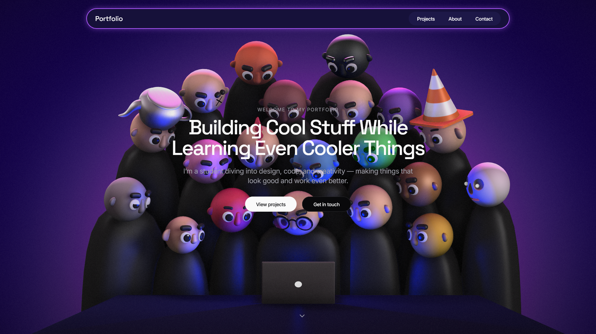

# 🌐 Personal Portfolio Website

Welcome to my personal portfolio website — a digital space to showcase my work, skills, and passion for design and development.

## 📌 About Me

Hi! I'm a second-year polytechnic student with a strong interest in UI/UX design and software development. My portfolio reflects a blend of creative design and technical projects, combining Figma prototypes, coding, and a touch of AI experimentation.

- 🎨 UI/UX Designer
- 💻 Frontend Developer
- 🧠 AI Learner
- 🎓 Polytechnic Student (2nd Year)

---

## 🛠️ Tech Stack

| Category      | Tools / Technologies               |
|---------------|------------------------------------|
| 💻 Languages   | HTML, CSS, JavaScript, TypeScript, C, C++, Python |
| 🧩 Frameworks | None (Vanilla and Lightweight tools only) |
| 🎨 Design     | Figma, Minimal UI principles       |
| 🌐 Deployment | GitHub Pages                        |
