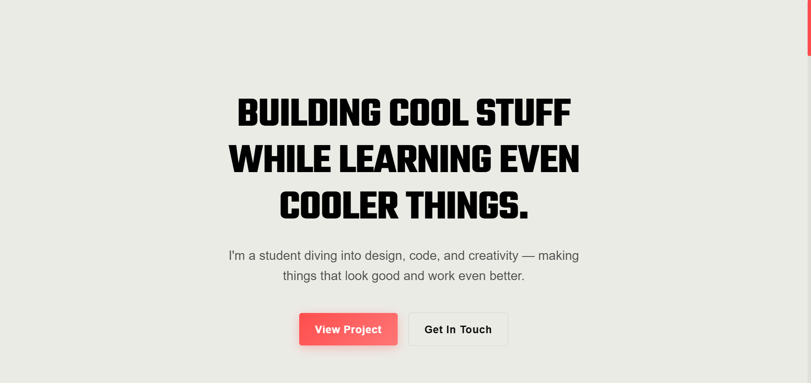

# 🚀 Vaibhav Ingle Portfolio

A modern, responsive portfolio website to showcase my projects, skills, and contact information. Designed with a focus on minimalism, smooth UX, and clean code.


---

## ✨ Features

- Minimal, Azuki-inspired UI/UX
- Responsive for all devices and zoom levels
- Animated hero section and interactive buttons
- Project showcase with modal popups
- Downloadable resume
- Contact form (Formspree)
- Custom cursor and subtle animations
- Social media integration

---

## 📁 Project Structure

```
portfolio-web/
├── assets/           # Images & media
├── favicon_io/       # Favicons
├── index.html        # Main HTML
├── style.css         # Main styles
├── theme-azuki.css   # Theme styles
├── script.js         # JS logic
├── cursor.js         # Custom cursor
├── resume.pdf        # Resume
├── vaibhav.png       # Profile image
```

---

## 🛠️ Tech Stack

- HTML5
- CSS3 (custom themes)
- JavaScript (ES6+)
- GSAP (animations)
- Formspree (contact form)

---

## 🚦 Getting Started

1. **Clone the repo:**
   ```sh
   git clone https://github.com/vaibhavingle2007/portfolio-web.git
   cd portfolio-web
   ```
2. **Open `index.html` in your browser.**
3. **Customize:**
   - Edit your name, about, and skills in `index.html`
   - Add/update projects in the Projects section
   - Replace images in `assets/`
   - Update your resume (`resume.pdf`)
   - Set up your Formspree form for the contact section

---

## 🖼️ Screenshots



---

## 📝 Customization

- **Theme:** Edit `theme-azuki.css` for colors and style
- **Profile & Socials:** Update your image and links in `index.html`
- **Projects:** Add new project cards in the Projects section

---

## 📬 Contact

- Email: [vaibhavingleg@gmail.com](mailto:vaibhavingleg@gmail.com)
- [GitHub](https://github.com/vaibhavingle2007)
- [Instagram](https://instagram.com/ninjavex_)

---

## 📄 License

Open source for personal portfolio use.

---

> Designed & developed by Vaibhav Ingle — Building digital experiences with passion and precision.
